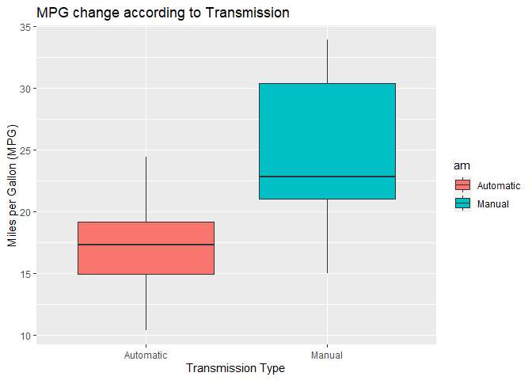

<!-- Sjustifying text -->
<style>
    body {
        text-align: justify;
    }
</style>
<hr>

## 1. Executive Summary  

This study involves analysis of Motor Trend's 'mtcars' data set to test whether a manual transmission is better than an automatic transmission for miles per gallon (MPG) performance of a car. The statistical testing and modeling is applied on the data set to test this hypothesis. The results of the study conclude that, in fact, manual transmission is better for MPG than an automatic transmission.  

## 2. Problem Description  

As Motor Trend prides itself in pioneer research on cars, the task is to find the impact of the type of transmission on the mileage (in miles per gallon) of cars; furthermore, the results are to be reported with substantial statistical evidence to support the particular outcome.  

The questions that are needed to be answered are:  
1. Is an automatic or manual transmission better for MPG?  
2. How different is the MPG between automatic manual transmission?  

Following discussion contains the modeling and conclusion of the research.  

</hr>

## 3. Investigation  

This section contains the initial EDA of data, possible answers to assigned questions, analysis, and graphical representation of the results.  

### 3.1 Exploratory Data Analysis  

To begin with, lets just have a brief EDA of the mtcars data set.

```r
# Loading necessary libraries and data
library(ggplot2)
data(mtcars)

# getting an overview of data
mtcars[sample(1:nrow(mtcars), size = 3),]
```

```
##              mpg cyl  disp  hp drat   wt qsec vs am gear carb
## Merc 230    22.8   4 140.8  95 3.92 3.15 22.9  1  0    4    2
## Merc 450SL  17.3   8 275.8 180 3.07 3.73 17.6  0  0    3    3
## Merc 450SLC 15.2   8 275.8 180 3.07 3.78 18.0  0  0    3    3
```

```r
str(mtcars)
```

```
## 'data.frame':	32 obs. of  11 variables:
##  $ mpg : num  21 21 22.8 21.4 18.7 18.1 14.3 24.4 22.8 19.2 ...
##  $ cyl : num  6 6 4 6 8 6 8 4 4 6 ...
##  $ disp: num  160 160 108 258 360 ...
##  $ hp  : num  110 110 93 110 175 105 245 62 95 123 ...
##  $ drat: num  3.9 3.9 3.85 3.08 3.15 2.76 3.21 3.69 3.92 3.92 ...
##  $ wt  : num  2.62 2.88 2.32 3.21 3.44 ...
##  $ qsec: num  16.5 17 18.6 19.4 17 ...
##  $ vs  : num  0 0 1 1 0 1 0 1 1 1 ...
##  $ am  : num  1 1 1 0 0 0 0 0 0 0 ...
##  $ gear: num  4 4 4 3 3 3 3 4 4 4 ...
##  $ carb: num  4 4 1 1 2 1 4 2 2 4 ...
```

```r
# Formatting necessary variables
mtcars$am[mtcars$am == "0"] <- "Automatic"
mtcars$am[mtcars$am == "1"] <- "Manual"

# Pre-liminary tests
test <- t.test(mpg ~ am, data = mtcars)
test$conf.int
```

```
## [1] -11.280194  -3.209684
## attr(,"conf.level")
## [1] 0.95
```

```r
test$p.value
```

```
## [1] 0.001373638
```

```r
# Initial visualization 
 g <- ggplot(mtcars, aes(x = am, y = mpg, fill = am))
 g <- g + geom_boxplot()
(g <- g + labs(x = "Transmission Type", 
               y = "Miles per Gallon (MPG)", 
               title = "MPG change according to Transmission"))
```


Here, the boxplot and t-test show that MPG is higher for manual transmission than for automatic transmission.  

### 3.2 Answers to Assigned Questions  

#### 3.2.1 Is an automatic or manual transmission better for MPG?  

First of all, we assume our null hypothesis that there is no difference in miles per gallon (mileage) based on the transmission type. In other words, the difference in the mean of the MPG based on transmission is zero. However, results of T-test show that there exists a difference in MPG of automatic and manual transmissions. This leads to the rejection of null hypothesis since the p-Value (0.0013736) of the results is below our preset alpha level of 0.05. Furthermore, the confidence interval does not contain zero.  
  
To further ascertain the results, lets fit a model and analyze the coefficients.

```r
fit1 <- lm(mpg ~ am, data = mtcars)
round(summary(fit1)$coef, 3)
```

```
##             Estimate Std. Error t value Pr(>|t|)
## (Intercept)   17.147      1.125  15.247        0
## amManual       7.245      1.764   4.106        0
```
Here, the model further verifies and supports the alternative hypothesis that **manual** transmission is better than **automatic** transmission. The slope of this model depicts that an increase of 7.245 in MPG is expected when changing from automatic to manual transmission. Moreover, the confidence interval of the t-test (-11.28, -3.21) further ascertains this point as moving from manual to automatic transmission decreases the MPG within the interval.  

#### 3.2.2 How different is the MPG between automatic manual transmission?  
  
Again having a look at the model coefficients.

```r
summary(fit1)$coef
```

```
##              Estimate Std. Error   t value     Pr(>|t|)
## (Intercept) 17.147368   1.124603 15.247492 1.133983e-15
## amManual     7.244939   1.764422  4.106127 2.850207e-04
```
The intercept **(17.147)** of the model shows the average value of the MPG for **automatic** transmission. The beta1 coefficient (slope) of this model shows that when we change from from automatic to **manual** transmission, average value of MPG increases by a number of **7.245**. Furthermore, p-values (1.1339835\times 10^{-15}, 2.8502074\times 10^{-4}) show that the model is statistically significant.  

## 4. Conclusion  
In view of all these, one can infer that **manual** transmission is **better** than **automatic** transmission for MPG. Moreover, the t-test and model results verify statistical significance of this hypothesis.
